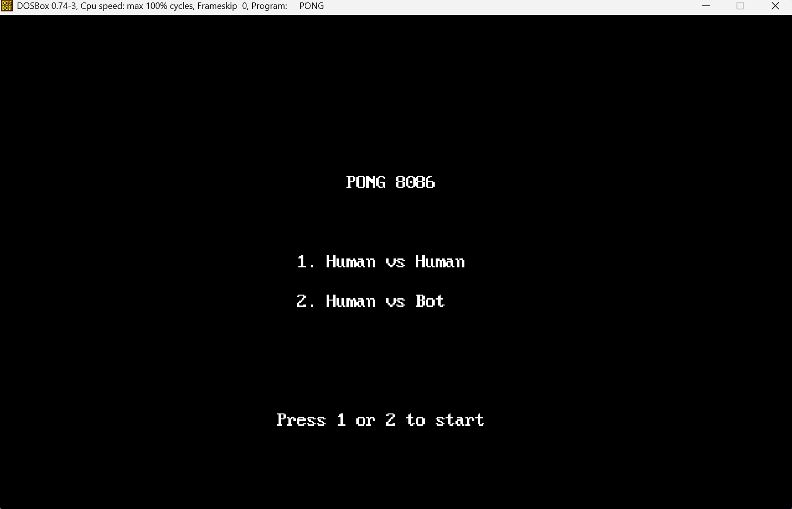
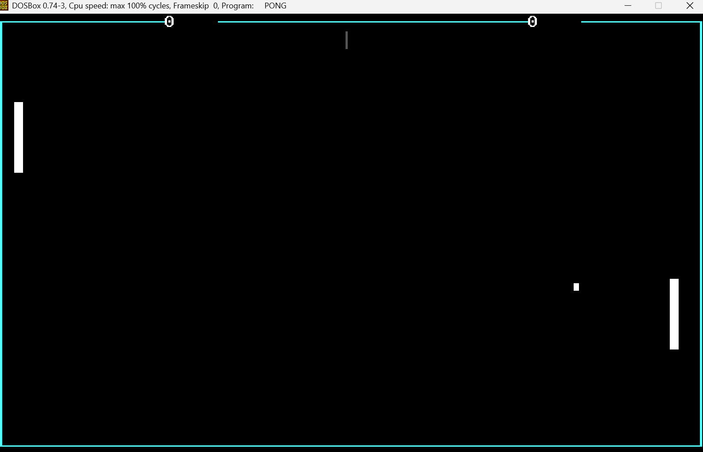

# Pong 8086

An implementation of the classic Pong arcade game written entirely in 8086 Assembly for MS-DOS.

This project was developed for the **Computer Structure and Language (CSL)** course at **Sharif University of Technology**. While the primary goal was to demonstrate low-level programming concepts—such as direct video memory access and hardware interrupt handling—the focus of this specific implementation is on smooth gameplay mechanics, accurate collision physics, and a reactive bot opponent.



## Gameplay Overview

The game operates in standard VGA text mode (80x25) but uses custom timing logic to exceed the standard BIOS refresh rates, resulting in fluid movement for both the ball and paddles.

The program includes two distinct modes selectable from the main menu:

1.  **Player vs Player:** Classic local multiplayer where two users share the keyboard.
2.  **Player vs Bot:** A single-player mode against a computer opponent.

### Key Features

*   **Reactive opponent:** The computer opponent does not simply track the ball's Y-coordinate perfectly. It includes a simulated reaction time (only tracking the ball when it crosses the midline) and a randomized error probability, making it beatable and more human-like.
*   **Sub-Tick Physics:** To prevent the ball from "tunneling" through paddles at high speeds, the collision system checks the ball's path vector rather than just its current position.
*   **Hardware Sound:** Sound effects for wall bounces, paddle hits, and scoring are generated by directly manipulating the Programmable Interval Timer (PIT) at port `43h` and the PC Speaker at port `61h`.
*   **Randomized Serves:** The ball's starting direction is randomized using the lower bits of the system clock (`INT 1Ah`), ensuring no two games start exactly the same way.



## Controls

The game runs in a standard DOS environment.

| Function | Player 1 (Left) | Player 2 (Right) |
| :--- | :---: | :---: |
| **Move Up** | `W` | `Up Arrow` |
| **Move Down** | `S` | `Down Arrow` |
| **Menu Selection** | `1` or `2` | - |
| **Exit** | `ESC` | - |

> **Note:** In "Player vs Computer" mode, the Right Paddle controls are disabled and handled by the bot logic.

## Build Instructions

### Prerequisites
*   **NASM** (Netwide Assembler)
*   **DOSBox** (or any compatible MS-DOS emulator)

### Compilation

To assemble the source code into a `.COM` executable:

```bash
mkdir -p build
nasm -f bin src/pong.asm -o build/pong.com
